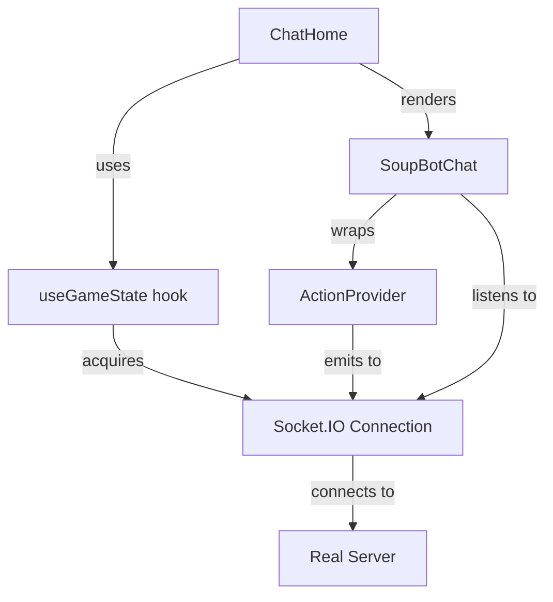
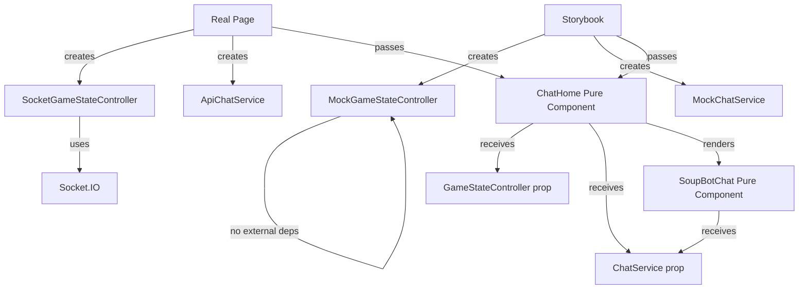

# Component Extraction Plan for Testable Chatbot Page

## Objective

Transform the ChatHome component into a pure, testable component that can be used in both production and Storybook with mock data. Enable comprehensive testing of all chatbot page states without requiring a real server connection.

## Current Architecture Analysis

### State Dependencies

The current ChatHome component has the following impurities that prevent easy testing:

| Component | Impurity Source | Description |
|-----------|----------------|-------------|
| ChatHome | useGameState hook | Directly manages Socket.IO connection and game state synchronization |
| SoupBotChat | Socket connection | Acquires socket for chat history sync and message broadcasting |
| ActionProvider | Socket emission | Emits chat messages to server via Socket.IO |
| useGameState | Socket.IO client | Establishes WebSocket connection, listens to server events |

### Data Flow



## Target Architecture

### Separation of Concerns Strategy

Extract all stateful logic and side effects into injectable dependencies, leaving pure components that only render data.



## Component Extraction Design

### 1. GameStateController Interface

Define an abstract interface for game state management that can be implemented with real or mock behavior.

#### Interface Definition

| Method/Property | Type | Description |
|----------------|------|-------------|
| gameState | GameState | Current game state (NotStarted, Started) |
| puzzleContent | PuzzleContent, null | Current puzzle data |
| isConnected | boolean | Connection status indicator |
| startGame | (content: PuzzleContent) => void | Initiate a new game session |
| resetGame | () => void | Reset game to initial state |

#### Implementation Variants

**SocketGameStateController**
- Wraps existing useGameState hook logic
- Manages Socket.IO connection lifecycle
- Synchronizes state via WebSocket events
- Used in production environment

**MockGameStateController**
- Implements interface with local state only
- No external dependencies
- Provides controllable state transitions for testing
- Used in Storybook stories

### 2. Pure ChatHome Component

Transform ChatHome into a pure component that receives all dependencies via props.

#### Props Interface

| Prop | Type | Required | Description |
|------|------|----------|-------------|
| gameStateController | GameStateController | Yes | Manages game state and puzzle content |
| chatService | ChatService | Yes | Handles chat message API calls |
| onStartGame | (content: PuzzleContent) => void | No | Callback when game starts (for tracking) |
| onResetGame | () => void | No | Callback when game resets (for tracking) |

#### Responsibilities

- Render UI based on received state
- Handle user interactions (button clicks, dialog interactions)
- Delegate state changes to gameStateController
- Display puzzle content from gameStateController
- Pass chatService to SoupBotChat
- No direct Socket.IO usage
- No internal state beyond UI-local concerns (dialog visibility)

### 3. Pure SoupBotChat Component

Refactor SoupBotChat to eliminate Socket.IO dependency.

#### Current Issues

- Acquires socket connection directly in useEffect
- Listens for CHAT_HISTORY_SYNC events
- Restores chat history from server
- Passes socket to ActionProvider

#### Refactoring Strategy

**Extract ChatHistoryController Interface**

| Method/Property | Type | Description |
|----------------|------|-------------|
| messages | ChatMessage[] | Initial chat history |
| onMessageAdded | (message: ChatMessage) => void | Callback when new message is added |
| syncHistory | () => Promise<ChatMessage[]> | Retrieve chat history |

**Remove Direct Socket Usage**
- Accept ChatHistoryController as prop
- Use controller to fetch initial messages
- Emit new messages via controller callback
- Remove socket acquisition logic

**Updated Props**

| Prop | Type | Required | Description |
|------|------|----------|-------------|
| chatService | ChatService | Yes | Existing chat API service |
| chatHistoryController | ChatHistoryController | No | Manages chat history sync |
| disabled | boolean | No | Disable input when game not started |

### 4. Pure ActionProvider Component

Eliminate Socket.IO emission from ActionProvider.

#### Current Socket Usage

- Receives socket via props from SoupBotChat
- Emits CHAT_MESSAGE_ADDED events for user and bot messages
- Checks socket.connected before emission

#### Refactoring Approach

**Move Socket Logic to ChatHistoryController**
- ActionProvider calls chatHistoryController.onMessageAdded
- Controller handles persistence (socket emission or mock storage)
- ActionProvider remains pure and testable

**Remove emitMessageToServer Method**
- Replace with controller callback
- Maintain same message structure
- Preserve metadata (replyToId, nickname, etc.)

**Updated Props**

| Prop | Type | Required | Description |
|------|------|----------|-------------|
| createChatBotMessage | any | Yes | react-chatbot-kit function |
| setState | Dispatch<SetStateAction<any>> | Yes | react-chatbot-kit state setter |
| children | ReactNode | Yes | Child components |
| chatService | ChatService | Yes | API service for chat responses |
| chatHistoryController | ChatHistoryController | No | Chat history management |

## Implementation Plan

### Phase 1: Define Abstractions

**Step 1.1: Create GameStateController Interface**
- Define TypeScript interface in new file: `src/features/chatbot/controllers/GameStateController.ts`
- Include all methods and properties listed above
- Export interface for use in components and implementations

**Step 1.2: Create ChatHistoryController Interface**
- Define TypeScript interface in new file: `src/features/chatbot/controllers/ChatHistoryController.ts`
- Include message sync and callback methods
- Define ChatMessage type if not already shared

### Phase 2: Create Mock Implementations

**Step 2.1: Implement MockGameStateController**
- Create file: `src/features/chatbot/controllers/MockGameStateController.ts`
- Use React useState for local state management
- Provide controllable state transitions
- Return hook-like interface: `useMockGameStateController(initialState?)`

**Step 2.2: Implement MockChatHistoryController**
- Create file: `src/features/chatbot/controllers/MockChatHistoryController.ts`
- Store messages in local state
- Implement in-memory history
- Return hook-like interface: `useMockChatHistoryController(initialMessages?)`

### Phase 3: Create Real Implementations

**Step 3.1: Implement SocketGameStateController**
- Create file: `src/features/chatbot/controllers/SocketGameStateController.ts`
- Extract existing useGameState hook logic
- Implement GameStateController interface
- Maintain current Socket.IO behavior
- Export as: `useSocketGameStateController()`

**Step 3.2: Implement SocketChatHistoryController**
- Create file: `src/features/chatbot/controllers/SocketChatHistoryController.ts`
- Extract chat history sync logic from SoupBotChat
- Implement ChatHistoryController interface
- Handle CHAT_HISTORY_SYNC events
- Emit CHAT_MESSAGE_ADDED events
- Export as: `useSocketChatHistoryController()`

### Phase 4: Refactor Components

**Step 4.1: Refactor ActionProvider**
- Update props to accept chatHistoryController
- Replace emitMessageToServer with controller callback
- Remove socket-related code
- Maintain backward compatibility with optional controller

**Step 4.2: Refactor SoupBotChat**
- Update props to accept chatHistoryController
- Remove direct socket acquisition
- Use controller for history sync instead
- Pass controller to ActionProvider
- Remove socket emission logic

**Step 4.3: Refactor ChatHome**
- Update props to accept gameStateController
- Remove useGameState hook usage
- Use controller methods for startGame and resetGame
- Use controller properties for gameState and puzzleContent
- Keep chatService prop as-is

### Phase 5: Update Integration Points

**Step 5.1: Update Production Page**
- File: `apps/web/app/page.tsx`
- Instantiate useSocketGameStateController
- Instantiate useSocketChatHistoryController
- Instantiate ApiChatService
- Pass all to ChatHome component

**Step 5.2: Update Storybook Stories**
- File: `apps/web/stories/ChatHome.stories.tsx`
- Create comprehensive story variants (see Phase 6)
- Use MockGameStateController for each state
- Use MockChatHistoryController with predefined messages
- Use MockChatService for bot responses

### Phase 6: Create Comprehensive Storybook Stories

Define stories for all testable states of the chatbot page.

#### Story Catalog

| Story Name | Game State | Puzzle Content | Chat History | Description |
|------------|-----------|----------------|--------------|-------------|
| NotStarted_Empty | NotStarted | null | Empty | Initial state, no game, no messages |
| NotStarted_WithHistory | NotStarted | null | 10 messages | Chat history persists after game reset |
| Started_JustBegun | Started | Sample puzzle | 1 message | Game just started with initial bot greeting |
| Started_ActiveConversation | Started | Sample puzzle | 15 messages | Mid-game with ongoing Q&A |
| Started_LongConversation | Started | Sample puzzle | 50 messages | Many messages to test scroll behavior |
| Started_WithReplies | Started | Sample puzzle | Messages with reply chains | Test reply threading UI |
| Started_WithErrors | Started | Sample puzzle | Includes error messages | Bot error responses visible |
| Started_LongPuzzleText | Started | Very long puzzle | 5 messages | Test layout with extensive puzzle content |
| Started_Disconnected | Started | Sample puzzle | 10 messages | Connection indicator shows disconnected |
| Started_LoadingResponse | Started | Sample puzzle | User sent, bot typing | Loading indicator visible |

#### Story Configuration Examples

**NotStarted_Empty**
```
gameStateController: useMockGameStateController({
  gameState: 'NotStarted',
  puzzleContent: null,
  isConnected: true
})
chatHistoryController: useMockChatHistoryController([])
chatService: new MockChatService()
```

**Started_ActiveConversation**
```
gameStateController: useMockGameStateController({
  gameState: 'Started',
  puzzleContent: {
    soupSurface: "某天，小明在公园里发现了一只受伤的小鸟...",
    soupTruth: "小明是一名兽医，他帮助小鸟恢复了健康..."
  },
  isConnected: true
})
chatHistoryController: useMockChatHistoryController(generateMockConversation(15))
chatService: new MockChatService({ responseDelay: 1000 })
```

**Started_Disconnected**
```
gameStateController: useMockGameStateController({
  gameState: 'Started',
  puzzleContent: { ... },
  isConnected: false
})
```

### Phase 7: Testing and Validation

**Step 7.1: Verify Story Functionality**
- Launch Storybook
- Navigate through all story variants
- Verify visual rendering matches expected state
- Test interactions (button clicks, message sending)
- Confirm no console errors

**Step 7.2: Verify Production Behavior**
- Run application with real server
- Test game start flow
- Verify chat messages persist
- Confirm socket reconnection works
- Ensure no regression from refactoring

**Step 7.3: Add Component Tests**
- Write unit tests for MockGameStateController
- Write unit tests for MockChatHistoryController
- Test pure ChatHome with different controller states
- Test ActionProvider with mock controller

## File Structure

```
apps/web/src/features/chatbot/
├── controllers/
│   ├── GameStateController.ts                 (interface)
│   ├── ChatHistoryController.ts               (interface)
│   ├── SocketGameStateController.ts           (real implementation)
│   ├── SocketChatHistoryController.ts         (real implementation)
│   ├── MockGameStateController.ts             (test implementation)
│   ├── MockChatHistoryController.ts           (test implementation)
│   └── index.ts                               (exports)
├── ChatHome.tsx                               (refactored pure component)
├── index.tsx                                  (SoupBotChat - refactored)
├── ActionProvider.tsx                         (refactored)
└── ... (existing files)

apps/web/stories/
└── ChatHome.stories.tsx                       (expanded with all states)

apps/web/app/
└── page.tsx                                   (updated integration)
```

## Migration Strategy

### Backward Compatibility

During refactoring, maintain backward compatibility by:
- Making new controller props optional initially
- Falling back to old behavior if controllers not provided
- Deprecating old behavior with console warnings
- Removing fallbacks after full migration

### Incremental Rollout

1. Add new interfaces and mock implementations
2. Create new stories using mocks
3. Add real controller implementations
4. Update components to use controllers (with fallbacks)
5. Update production page to pass controllers
6. Remove fallback logic and old code

## Benefits

### Testability
- All page states testable in isolation
- No server required for visual testing
- Deterministic test scenarios
- Fast feedback loop

### Maintainability
- Clear separation of concerns
- Pure components easier to reason about
- Dependencies explicitly declared
- Reduced coupling to Socket.IO

### Development Experience
- Storybook becomes comprehensive design system
- Visual regression testing possible
- Easier onboarding for new developers
- Better documentation through stories

### Flexibility
- Easy to swap implementations (e.g., different transport layer)
- Can test error states and edge cases
- Mock data generation for demos
- Simplified integration testing
