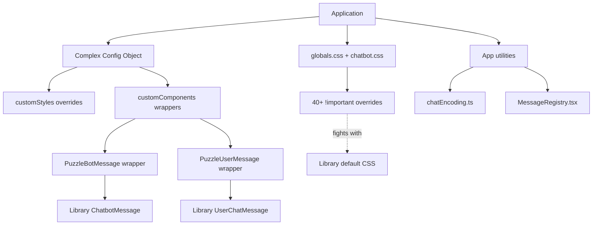
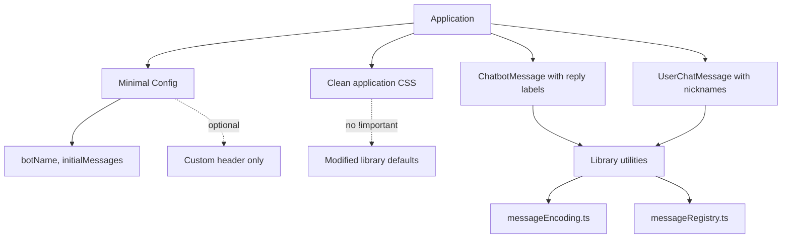

# Migration Design: React Chatbot Kit Integration Optimization

## Context

The application previously used `react-chatbot-kit` as an external npm dependency. The library source code has now been integrated into the monorepo at `packages/react-chatbot-kit`. However, the consuming application (`apps/web`) still uses the library in a "black box" manner with workarounds that were necessary when it was external:

- CSS overrides using `!important` declarations to force style changes
- Custom component props in config to replace default components
- Custom styles config objects for limited theming
- Importing pre-built CSS from `build/main.css`
- Working around limitations rather than fixing root causes

Now that the source code is local and under direct control, these indirect approaches should be replaced with direct source code modifications.

## Strategic Goals

1. **Eliminate CSS Override Warfare**: Remove all `!important` declarations by modifying default styles at source
2. **Integrate All Customizations**: Move custom features (reply labels, nicknames) into library source code
3. **Remove Build Artifacts Dependency**: Use source CSS files directly instead of built artifacts  
4. **Simplify Configuration**: Eliminate wrapper components and config-based overrides
5. **Improve Maintainability**: Make the chatbot package a true first-party component, not a third-party library façade
6. **Preserve Functionality**: Maintain all existing features (reply labels, nickname display, scroll-to-message, etc.)

## Current Architecture Analysis

### Current Workaround Patterns

| Pattern | Location | Purpose | Limitation |
|---------|----------|---------|------------|
| CSS `!important` overrides | `apps/web/app/globals.css` | Force layout (height 100%, flexbox, colors) | Brittle, fights with library defaults |
| CSS `!important` overrides | `apps/web/src/features/chatbot/chatbot.css` | Force layout adjustments | Same cascading specificity issues |
| Custom component props | `apps/web/src/features/chatbot/config.tsx` | Replace header, bot messages, user messages | Adds wrapper layer complexity |
| Built CSS import | `apps/web/app/layout.tsx`, stories | Include library styles | Uses build artifact instead of source |
| Custom style objects | `config.tsx` customStyles | Theme bot/user message boxes | Limited to specific supported properties |

### Identified Unnecessary Patterns

#### 1. CSS Override Dependencies

**Current State**:
- `globals.css` contains ~25 `!important` declarations
- `chatbot.css` contains ~15 `!important` declarations
- These override defaults in `packages/react-chatbot-kit/src/components/Chat/Chat.css`
- Overrides target: container sizing, colors, layouts, borders

**Why This Was Necessary Before**:
Library CSS was bundled and shipped as final artifact. Consumer had no choice but to override with higher specificity.

**Why This Is Unnecessary Now**:
Direct access to source CSS means defaults can be changed directly without fighting specificity.

#### 2. Build Artifact CSS Imports

**Current State**:
```
import '@vibe-ltp/react-chatbot-kit/build/main.css';
```

This imports the webpack-bundled CSS output.

**Why This Was Necessary Before**:
Library distributed only built artifacts, not raw source.

**Why This Is Unnecessary Now**:
Source CSS files are available. Can import directly from `src/components/**/*.css` or consolidate into application styles.

#### 3. Limited Custom Component Approach

**Current State**:
Config defines:
- `customComponents.header` - Custom header with nickname badge
- `customComponents.botChatMessage` - Wraps message with reply label
- `customComponents.userChatMessage` - Adds nickname display and registration

**Why This Pattern Is Unnecessary Now**:
These wrapper components exist solely to add features that should be built into the library itself. They add indirection and complexity. With direct source access, these features should be integrated into the source components.

#### 4. Style Config Object Limitations

**Current State**:
```javascript
customStyles: {
  botMessageBox: { backgroundColor: '#2d2d30', color: '#cccccc' },
  userMessageBox: { backgroundColor: '#094771', color: '#ffffff' },
  chatButton: { backgroundColor: '#0e639c' },
}
```

**Why This Is Limited**:
Only specific properties are supported by the library's interface. Cannot control margins, widths, borders, etc. through this mechanism.

**Why Direct CSS Modification Is Better**:
Full control over all CSS properties without interface limitations.

## Migration Strategy

### Architecture Transformation

**Before: External Library Pattern**



**After: First-Party Component Pattern**



**Key Differences**:
- Config: Complex object → Minimal configuration
- Components: Wrappers → Direct usage with integrated features
- CSS: Override warfare → Clean defaults
- Utilities: App-specific → Library-owned
- Mental model: External dependency → First-party code

### Phase 1: CSS Consolidation and Source Modification

**Objective**: Eliminate all `!important` overrides by changing defaults at source.

#### Task 1.1: Modify Default Library CSS

**Target Files**:
- `packages/react-chatbot-kit/src/components/Chat/Chat.css`
- `packages/react-chatbot-kit/src/components/ChatbotMessage/ChatbotMessage.css`
- `packages/react-chatbot-kit/src/components/UserChatMessage/UserChatMessage.css`

**Changes Required**:

| CSS Class | Current Default | Desired Change | Rationale |
|-----------|----------------|----------------|-----------|
| `.react-chatbot-kit-chat-container` | `width: 275px` | Remove fixed width, use `width: 100%` | Support full-width container |
| `.react-chatbot-kit-chat-inner-container` | `height: 500px; background-color: #fff` | Remove fixed height, use flex: 1; change bg to `#252526` | Support dynamic sizing + dark theme |
| `.react-chatbot-kit-chat-message-container` | `height: 424px` | Change to `flex: 1` + `overflow-y: auto` | Allow flexible message area |
| `.react-chatbot-kit-chat-input-container` | `position: absolute; bottom: 0` | Change to `flex-shrink: 0` (remove absolute positioning) | Work with flex layout |
| `.react-chatbot-kit-chat-header` | `background-color: #efefef; color: #514f4f` | Change to `#2d2d30` / `#ffffff` | Dark theme colors |
| `.react-chatbot-kit-chat-input` | `background-color: (default); color: (default)` | Add dark theme colors | Consistent theming |
| `.react-chatbot-kit-chat-bot-message` | `background-color: #2898ec; color: #fff` | Change to `#2d2d30` / `#cccccc` | Dark theme for bot messages |
| `.react-chatbot-kit-user-chat-message` | `background-color: #f1f1f1; color: #585858` | Change to `#094771` / `#ffffff` | Dark theme for user messages |
| `.react-chatbot-kit-chat-btn-send` | `background-color: #2898ec` | Change to `#0e639c` | Consistent brand color |

**Implementation Approach**:
- Modify default values directly in source CSS files
- Add flex layout properties to support container-driven sizing
- Update color scheme to dark theme by default
- Remove fixed dimensions that prevent responsive behavior

#### Task 1.2: Remove `!important` Overrides from Application CSS

**Target Files**:
- `apps/web/app/globals.css`
- `apps/web/src/features/chatbot/chatbot.css`

**Changes Required**:

After library defaults are updated, these files should:
- Remove all `!important` declarations targeting react-chatbot-kit classes
- Keep only application-specific styles (e.g., `.puzzle-bot-reply-label`, `.puzzle-chat-highlight`)
- Retain disabled state styles (`.chatbot-disabled`) as these are application-specific

**Styles to Preserve**:
- Application root variables and body styles
- `.puzzle-bot-message-wrapper` and related custom component styles
- `.puzzle-bot-reply-label` interaction styles
- `.puzzle-chat-highlight` animation
- `.chatbot-disabled` state styles

**Styles to Remove**:
All overrides of `.react-chatbot-kit-*` classes that duplicate source CSS changes.

### Phase 2: Integrate Customizations into Source

**Objective**: Eliminate all config-based customizations by integrating features directly into the library source. Prioritize simplicity by removing the customization layer entirely.

**Principle**: Since this is now a first-party component owned by the application, treat it as such. No more config-based overrides - all features are built-in.

#### Current Customizations to Integrate

| Feature | Current Location | Integration Target | Complexity |
|---------|------------------|-------------------|------------|
| Reply labels for bot messages | `PuzzleBotMessage` wrapper | `ChatbotMessage.tsx` source | Low - decode message and render label |
| Nickname display for user messages | `PuzzleUserMessage` wrapper | `UserChatMessage.tsx` source | Low - decode message and render nickname |
| Message registry for scroll-to | `PuzzleUserMessage` wrapper | `UserChatMessage.tsx` source | Low - useEffect registration |
| Identity context integration | `useChatIdentity` hook | Pass via component props | Low - accept nickname as prop |
| Custom header with nickname badge | `config.customComponents.header` | Chat header source or app-level | Medium - needs identity context |

#### Task 2.1: Integrate Bot Message Reply Labels

**Current Approach**:
- `PuzzleBotMessage` wraps the library's message component
- Decodes metadata from message string (using `decodeBotMessage`)
- Renders reply label button above message bubble if metadata exists
- Handles click to scroll to referenced message

**Integration Strategy**:

1. **Move decoding logic into source component**
   - Import `decodeBotMessage` from application utils into `ChatbotMessage.tsx`
   - Or: move encoding/decoding utilities to the library package itself

2. **Render reply label directly in ChatbotMessage**
   - Add reply label rendering before the message bubble
   - Import `scrollToMessage` function or accept as callback prop

3. **Update component structure**
   - Change from conditional wrapper to built-in feature
   - Reply label appears whenever message contains reply metadata

**Result**: No need for `customComponents.botChatMessage` config. Library component handles this natively.

#### Task 2.2: Integrate User Message Nickname Display

**Current Approach**:
- `PuzzleUserMessage` wraps the library's user message component
- Decodes nickname from message string (using `decodeUserText`)
- Displays nickname label above message bubble
- Shows "You" indicator if nickname matches current user
- Registers message element for scroll-to functionality

**Integration Strategy**:

1. **Move decoding logic into source component**
   - Import `decodeUserText` from application utils into `UserChatMessage.tsx`
   - Or: move to library package

2. **Add nickname display to UserChatMessage**
   - Render nickname label above message bubble
   - Accept current user nickname as prop to show "You" indicator

3. **Integrate message registration**
   - Import `registerMessageElement` and `MessageRegistry` utilities
   - Add useEffect hook for element registration
   - Generate deterministic message ID from content

**Result**: No need for `customComponents.userChatMessage` config. Library component handles this natively.

#### Task 2.3: Handle Identity Context Dependency

**Challenge**: Source library components cannot directly use `useChatIdentity` hook as it's application-specific.

**Solution Options**:

**Option A: Pass nickname as prop**
- `UserChatMessage` accepts `currentUserNickname?: string` prop
- Chatbot component accepts this prop and passes it down
- Application provides it: `<Chatbot currentUserNickname={nickname} .../>`
- Simple, explicit data flow

**Option B: Move identity context to library**
- Move `IdentityProvider` and `useChatIdentity` to library package
- Library components can use hook directly
- More integrated but couples library to identity concept

**Recommendation**: Option A. Keep identity in application, pass as prop. Simpler and more explicit.

#### Task 2.4: Handle Utility Dependencies

**Challenge**: Custom components use application-specific utilities:
- `chatEncoding.ts` - encode/decode message metadata
- `MessageRegistry.tsx` - register elements and scroll functionality

**Solution**: Move utilities to library package

1. **Move encoding utilities**
   - Create `packages/react-chatbot-kit/src/utils/messageEncoding.ts`
   - Move `encodeBotMessage`, `decodeBotMessage`, `encodeUserText`, `decodeUserText`
   - Update imports in application code

2. **Move message registry**
   - Create `packages/react-chatbot-kit/src/utils/messageRegistry.ts`
   - Move registry singleton and scroll functions
   - Update imports in application code

**Result**: Library is self-contained with all necessary utilities.

#### Task 2.5: Handle Custom Header

**Current Approach**: `config.customComponents.header` renders custom header with nickname badge.

**Analysis**:
- Header contains `NicknameBadge` component with identity management UI
- This is application-specific functionality (puzzle game nickname system)
- Not a general chatbot library concern

**Options**:

**Option A: Keep as application-level customization**
- This is the ONE exception where config makes sense
- Header is truly application-specific (nickname badge, game context)
- Keep `customComponents.header` in config

**Option B: Make header slot more explicit**
- Instead of `customComponents.header`, have `headerComponent` prop on Chatbot
- Same result, more explicit API

**Recommendation**: Option A if we must keep one config option, or Option B for cleaner API. Either way, header remains customizable as it's application UI, not message rendering.

#### Task 2.6: Simplify Configuration Interface

After integrating customizations:

**Before**:
```javascript
config = {
  botName: '主持人',
  initialMessages: [],
  customComponents: {
    header: () => <CustomHeader />,
    botChatMessage: (props) => <PuzzleBotMessage {...props} />,
    userChatMessage: (props) => <PuzzleUserMessage {...props} />,
  },
  customStyles: { ... },
}
```

**After**:
```javascript
config = {
  botName: '主持人',
  initialMessages: [],
  customComponents: {
    header: () => <CustomHeader />,  // Only if needed
  },
}
```

Or even simpler with direct props:
```javascript
<Chatbot
  config={config}
  headerComponent={<CustomHeader />}
  currentUserNickname={nickname}
  ...
/>
```

**Result**: Dramatically simplified configuration. Most functionality is built-in.

### Phase 3: Build Process Optimization

**Objective**: Evaluate whether to continue using webpack build process or switch to direct source imports.

#### Current Build Process

- Webpack bundles `src/index.ts` and all CSS into `build/index.js` and `build/main.css`
- Package.json points `main` to `build/index.js`
- Consumer imports built artifacts

#### Option A: Keep Build Process (Recommended for Now)

**Rationale**:
- TypeScript compilation and CSS bundling are handled
- Package remains consumable as a standard dependency
- Future possibility of publishing as standalone package maintained
- Separation of build concerns

**Action**: Keep current webpack build. CSS changes in source will be reflected in build output.

#### Option B: Direct Source Imports

**Rationale**:
- Could import directly from `src/` files
- Eliminates build step
- More transparent for development

**Challenges**:
- Would require configuring Next.js to transpile the package
- CSS imports would need different handling
- Loses encapsulation benefits

**Recommendation**: Option A. Keep build process but ensure source CSS changes are properly bundled.

### Phase 4: Remove Custom Styles Config

**Objective**: Since defaults are now modified at source, remove redundant `customStyles` config.

**Target File**: `apps/web/src/features/chatbot/config.tsx`

**Current Custom Styles**:
```javascript
customStyles: {
  botMessageBox: {
    backgroundColor: '#2d2d30',
    color: '#cccccc',
  },
  userMessageBox: {
    backgroundColor: '#094771',
    color: '#ffffff',
  },
  chatButton: {
    backgroundColor: '#0e639c',
  },
  chatContainer: {
    height: '100%',
    width: '100%',
  },
}
```

**Action After Phase 1**:
- Remove `customStyles` object entirely from config
- These values are now defaults in source CSS
- Config becomes simpler and more declarative

### Phase 5: CSS Import Path Update (Optional)

**Objective**: Decide whether to keep importing `build/main.css` or switch to direct source CSS imports.

#### Current Import Pattern

```javascript
import '@vibe-ltp/react-chatbot-kit/build/main.css';
```

**Locations**:
- `apps/web/app/layout.tsx`
- `apps/web/src/features/chatbot/index.tsx`
- `apps/web/.storybook/preview.ts`
- `apps/web/stories/ChatbotWithReplyLabels.stories.tsx`

#### Option A: Continue Using Build Artifact

**Rationale**:
- Build process bundles all component CSS into single file
- Standard pattern for consuming packages
- Works with current webpack configuration

**Action**: No change. Continue importing `build/main.css`.

#### Option B: Import Source CSS Files

**Rationale**:
- More direct reflection of source changes during development
- Could bypass build step in dev mode

**Challenges**:
- Would need to import multiple CSS files or create consolidated import
- Changes webpack configuration expectations

**Recommendation**: Option A. Keep importing build artifact. Source changes are reflected after rebuild.

## Implementation Plan

### Step 1: Backup and Baseline
1. Document all current `!important` overrides and their purposes
2. Create test checklist covering all visual aspects and functionality
3. Take screenshots of current UI for comparison

### Step 2: Modify Library Source CSS
1. Update `packages/react-chatbot-kit/src/components/Chat/Chat.css` with new defaults
2. Update `packages/react-chatbot-kit/src/components/ChatbotMessage/ChatbotMessage.css`
3. Update `packages/react-chatbot-kit/src/components/UserChatMessage/UserChatMessage.css`
4. Rebuild package: `pnpm --filter @vibe-ltp/react-chatbot-kit build`

### Step 3: Update Application CSS
1. Remove `!important` overrides from `apps/web/app/globals.css`
2. Remove `!important` overrides from `apps/web/src/features/chatbot/chatbot.css`
3. Keep application-specific styles (puzzle, highlight, disabled states)
4. Verify no visual regressions

### Step 4: Integrate Customizations into Source

1. **Move utilities to library package**
   - Create `packages/react-chatbot-kit/src/utils/messageEncoding.ts`
   - Move encoding/decoding functions from app to library
   - Create `packages/react-chatbot-kit/src/utils/messageRegistry.ts`
   - Move message registry and scroll functions
   - Update imports in application code

2. **Integrate reply labels into ChatbotMessage**
   - Modify `packages/react-chatbot-kit/src/components/ChatbotMessage/ChatbotMessage.tsx`
   - Import `decodeBotMessage` and `scrollToMessage` utilities
   - Decode message metadata in component
   - Render reply label button when metadata present
   - Remove `customComponents.botChatMessage` from config

3. **Integrate nickname display into UserChatMessage**
   - Modify `packages/react-chatbot-kit/src/components/UserChatMessage/UserChatMessage.tsx`
   - Import `decodeUserText` and message registration utilities
   - Accept `currentUserNickname?: string` prop
   - Decode message to extract nickname
   - Render nickname label above message
   - Register element for scroll-to functionality
   - Remove `customComponents.userChatMessage` from config

4. **Update Chatbot component interface**
   - Add `currentUserNickname?: string` prop to Chatbot component
   - Pass prop down to Chat component
   - Pass to UserChatMessage component

5. **Simplify application config**
   - Remove `customStyles` object (defaults changed at source)
   - Remove `customComponents.botChatMessage` (integrated to source)
   - Remove `customComponents.userChatMessage` (integrated to source)
   - Keep only `customComponents.header` if still needed for nickname badge
   - Or replace with `headerComponent` prop on Chatbot for cleaner API

6. **Update application usage**
   - Update `apps/web/src/features/chatbot/index.tsx`
   - Pass `currentUserNickname={nickname}` to Chatbot
   - Remove wrapper component references
   - Delete obsolete custom component files

7. **Rebuild library**
   - Run `pnpm --filter @vibe-ltp/react-chatbot-kit build`
   - Verify all source changes are bundled correctly

### Step 5: Testing and Validation
1. Visual testing: Compare before/after screenshots
2. Functional testing:
   - Verify reply labels appear on bot messages with metadata
   - Test scroll-to-message when clicking reply label
   - Verify nickname display on user messages
   - Verify "You" indicator for current user's messages
   - Test message element registration and scroll highlighting
3. Test in both Next.js app and Storybook
4. Test disabled state styling
5. Test responsive behavior
6. Verify encoding/decoding still works after moving utilities

### Step 6: Cleanup
1. Delete obsolete custom component files:
   - `apps/web/src/features/chatbot/components/PuzzleBotMessage.tsx`
   - `apps/web/src/features/chatbot/components/PuzzleUserMessage.tsx`
   - Update `components/index.ts` exports
2. Delete moved utility files from app (now in library):
   - Check if `chatEncoding.ts` has been fully moved
   - Check if `MessageRegistry.tsx` has been fully moved
3. Update any remaining imports in application code

### Step 7: Documentation
1. Update library README to document built-in features:
   - Message encoding format for reply metadata
   - Message encoding format for user nicknames
   - How to use `currentUserNickname` prop
   - Message registry and scroll-to functionality
2. Document the styling approach (modify source CSS, not override)
3. Add developer notes: "This is a first-party component - modify source directly, not via config overrides"

## Risk Assessment

| Risk | Impact | Likelihood | Mitigation |
|------|--------|------------|------------|
| Visual regressions after CSS changes | High | Medium | Thorough visual testing, screenshot comparison |
| Build process issues | Medium | Low | Test build after each change, verify output |
| CSS specificity conflicts remain | Medium | Low | Careful review of selector specificity in source |
| Custom component integration breaks | High | Low | Keep custom components as-is in Phase 2 |
| Storybook styling differs from app | Medium | Medium | Test both environments, ensure consistent CSS imports |

## Success Criteria

1. **Zero `!important` declarations** targeting react-chatbot-kit classes in application CSS
2. **Zero wrapper components** - `PuzzleBotMessage` and `PuzzleUserMessage` deleted
3. **Minimal config object** - Only `botName` and `initialMessages`, possibly `customComponents.header` for nickname badge
4. **Utilities in library** - Message encoding and registry moved to library package
5. **Features integrated** - Reply labels and nickname display built into source components
6. **Visual parity** with current implementation (confirmed by screenshot comparison)
7. **Functional parity** for all features (reply labels, nicknames, scroll, disabled state)
8. **Consistent styling** between Next.js app and Storybook
9. **Cleaner application code** - Simpler imports, less indirection, easier to understand

## Future Considerations

### Potential Follow-up Enhancements

1. **Avatar Customization**: Currently, bot avatar shows hardcoded "B". Could be replaced with custom icon or removed entirely by modifying source component.

2. **Message Arrow Removal**: Message arrows (`.react-chatbot-kit-chat-bot-message-arrow`) are currently hidden via CSS. Could remove from source component template entirely.

3. **TypeScript Interface Updates**: If modifying component props, ensure TypeScript interfaces in `packages/react-chatbot-kit/src/interfaces/` are updated to reflect new capabilities.

4. **Consolidate CSS Files**: Consider whether to consolidate library CSS into a single source file rather than per-component files for easier theming.

5. **Theme Configuration System**: If dark theme is now the default, consider adding a theme configuration system to the library for future light theme support if needed.

## Conclusion

The migration strategy transforms the react-chatbot-kit package from a "third-party library we wrap and override" into a "first-party component we own completely." The core philosophy is **radical simplification**:

1. **No more CSS warfare** - Change defaults at source, not via `!important` overrides
2. **No more wrapper components** - Integrate features directly into source components  
3. **No more config complexity** - Remove customization layer entirely
4. **First-party mindset** - Treat the library as application code, not external dependency

The key insight is that when you own the source, you should modify it directly rather than building elaborate override systems. The result is:

- **Cleaner application code**: No wrapper components, minimal config
- **Self-contained library**: All features built-in, utilities included
- **Better maintainability**: Single source of truth, no indirection
- **Simpler mental model**: "Need a feature? Add it to the source."

This approach embraces the reality that react-chatbot-kit is now part of the application codebase, not a separate dependency to work around.
