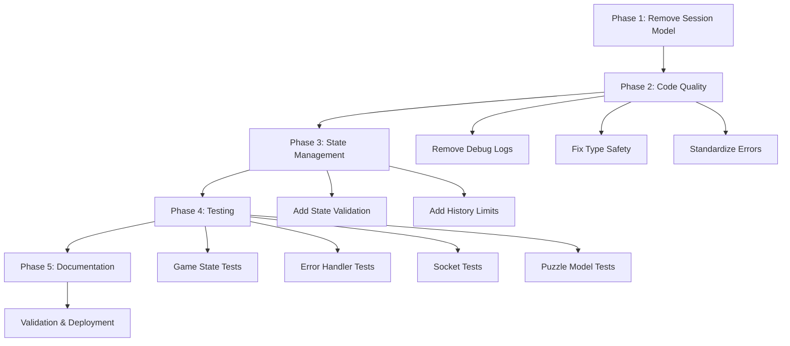

# Codebase Refactoring Design

## Overview

This design outlines a comprehensive refactoring strategy for the vibe-ltp codebase to improve code quality, maintainability, and architectural consistency. The refactoring will be executed in clear phases with a big-bang approach, focusing on removing unused domain models, enhancing code quality, and establishing comprehensive test coverage.

## Design Principles

### Core Objectives

1. **Code Quality Enhancement**: Remove debug code, eliminate type safety issues, standardize error handling
2. **Architecture Simplification**: Remove unused Session domain model to align with single-session architecture
3. **Test Coverage**: Establish comprehensive unit tests for all refactored components
4. **Maintainability**: Improve code organization, consistency, and documentation

### Architectural Constraints

- Maintain single-page, single-session game architecture (no room-based multiplayer)
- Preserve existing monorepo structure and package boundaries
- Keep domain logic framework-agnostic where applicable
- Ensure backward compatibility with existing frontend-backend contracts during transition

## Current State Analysis

### Code Quality Issues

| Issue Category | Locations | Impact |
|---------------|-----------|---------|
| Debug Console Logs | server/src (index.ts, sockets/index.ts, routes/chat.ts), web/src (hooks/useGameState.tsx, ActionProvider.tsx), llm-client/src | Production noise, performance overhead |
| TypeScript `any` Usage | llm-client/src/agent.ts (lines 22, 41) | Type safety compromise |
| Excessive Logging | Multiple socket and chat handlers | Log verbosity in production |

### Unused Domain Models

**Session Model (`packages/puzzle-core/src/models/Session.ts`)**
- Status: Fully implemented but not integrated
- Reason: Single-session architecture uses global state instead
- Decision: Remove to prevent confusion and maintenance burden
- Files to Remove:
  - `packages/puzzle-core/src/models/Session.ts`
  - `packages/puzzle-core/src/session/sessionHelpers.ts`
  - `packages/puzzle-core/src/session/index.ts`
  - `packages/puzzle-core/src/tests/session.spec.ts`

### Architecture Gaps

1. **State Management**: Global state in `gameState.ts` lacks domain model encapsulation
2. **Error Handling**: Inconsistent error handling patterns across server routes
3. **Type Safety**: Socket event handlers have weak typing
4. **Testing**: Minimal unit test coverage outside of removed Session tests

## Refactoring Strategy

### Phase 1: Remove Unused Domain Models

**Objective**: Clean up codebase by removing Session-related code

**Actions**:

1. Delete Session domain model files:
   - `packages/puzzle-core/src/models/Session.ts`
   - `packages/puzzle-core/src/session/sessionHelpers.ts`
   - `packages/puzzle-core/src/session/index.ts`
   - `packages/puzzle-core/src/tests/session.spec.ts`

2. Update package exports:
   - `packages/puzzle-core/src/index.ts`: Remove session export
   - `packages/puzzle-core/src/models/index.ts`: Remove Session export if present

3. Verify no imports of Session exist in:
   - Server code (`apps/server/src`)
   - Web code (`apps/web/src`)
   - Other packages

**Validation**:
- TypeScript compilation succeeds across all packages
- No orphaned imports remain
- Existing tests pass (if any remain after Session test removal)

### Phase 2: Code Quality Improvements

**Objective**: Enhance type safety, remove debug code, standardize patterns

#### 2.1 Remove Debug Console Logs

**Production Logging Strategy**:
- Keep startup configuration logs in `apps/server/src/index.ts` (lines 18-22, 45, 69)
- Keep connection lifecycle logs: connect, disconnect events
- Remove verbose operational logs: message content dumps, state dumps

**Files to Refactor**:

| File | Lines to Remove | Replacement Strategy |
|------|----------------|---------------------|
| `apps/server/src/http/routes/chat.ts` | 14-15, 22, 42, 60-64 | Keep error logs only |
| `apps/server/src/sockets/index.ts` | 18-24, 45-53 | Keep connect/disconnect, remove message dumps |
| `apps/web/src/features/chatbot/hooks/useGameState.tsx` | 10-11 | Remove environment debug logs |
| `apps/web/src/features/chatbot/ActionProvider.tsx` | 104-111 | Remove message inspection logs |
| `packages/llm-client/src/puzzleAgent.ts` | 154-167, 178-179 | Use structured logging interface |

**Structured Logging Interface** (Optional Enhancement):

Create `packages/shared/src/logging/logger.ts`:

```typescript
interface Logger {
  error(message: string, context?: Record<string, unknown>): void;
  warn(message: string, context?: Record<string, unknown>): void;
  info(message: string, context?: Record<string, unknown>): void;
  debug(message: string, context?: Record<string, unknown>): void;
}

class ConsoleLogger implements Logger {
  constructor(private readonly level: 'error' | 'warn' | 'info' | 'debug') {}
  
  error(message: string, context?: Record<string, unknown>): void {
    console.error(message, context || '');
  }
  
  warn(message: string, context?: Record<string, unknown>): void {
    if (this.shouldLog('warn')) console.warn(message, context || '');
  }
  
  info(message: string, context?: Record<string, unknown>): void {
    if (this.shouldLog('info')) console.info(message, context || '');
  }
  
  debug(message: string, context?: Record<string, unknown>): void {
    if (this.shouldLog('debug')) console.debug(message, context || '');
  }
  
  private shouldLog(level: string): boolean {
    const levels = ['error', 'warn', 'info', 'debug'];
    return levels.indexOf(level) <= levels.indexOf(this.level);
  }
}

export function createLogger(level?: string): Logger {
  const logLevel = (level || process.env.LOG_LEVEL || 'info') as 'error' | 'warn' | 'info' | 'debug';
  return new ConsoleLogger(logLevel);
}
```

#### 2.2 Fix TypeScript Type Safety

**Issue**: `any` usage in `packages/llm-client/src/agent.ts`

**Location 1** (line 22):
```typescript
const aiTools: Record<string, any> = {};
```

**Solution**: Use proper AI SDK types
```typescript
import type { CoreTool } from 'ai';

const aiTools: Record<string, CoreTool> = {};
```

**Location 2** (line 41):
```typescript
model: openRouter(model) as any,
```

**Solution**: Import and use correct type
```typescript
import type { LanguageModel } from 'ai';

model: openRouter(model) as LanguageModel,
```

**Validation**:
- `pnpm typecheck` passes without errors
- No new `any` types introduced

#### 2.3 Standardize Error Handling

**Pattern**: Consistent error handling in Socket.IO handlers

**Current Pattern** (from `apps/server/src/sockets/index.ts`):
```typescript
try {
  // operation
  if (callback) callback({ success: true });
} catch (error) {
  console.error('[Socket] Error:', error);
  if (callback) callback({ success: false, error: String(error) });
}
```

**Standardized Pattern**:

Create error handling utility in `apps/server/src/utils/errorHandler.ts`:

```typescript
interface SocketCallback {
  (response: { success: boolean; error?: string }): void;
}

export function handleSocketError(
  error: unknown,
  context: string,
  callback?: SocketCallback
): void {
  const errorMessage = error instanceof Error ? error.message : String(error);
  console.error(`[Socket] ${context}:`, errorMessage);
  
  if (callback) {
    callback({ success: false, error: errorMessage });
  }
}

export function sendSocketSuccess(callback?: SocketCallback): void {
  if (callback) {
    callback({ success: true });
  }
}
```

**Apply to handlers**:
- `GAME_STARTED` handler
- `GAME_RESET` handler
- Future socket event handlers

### Phase 3: Enhanced State Management

**Objective**: Improve gameState module with better encapsulation

**Current Issues**:
- Direct state mutation via exported functions
- No validation on state transitions
- Chat message history grows unbounded

**Enhanced Game State Design** (`apps/server/src/state/gameState.ts`):

#### State Transition Validation

Add state machine validation:

| From State | To State | Valid? | Validation Rule |
|-----------|----------|--------|----------------|
| NotStarted | Started | ✓ | Must have puzzle content |
| Started | NotStarted | ✓ | Reset operation |
| Started | Started | ✗ | Cannot restart without reset |

```typescript
interface StateTransition {
  from: GameState;
  to: GameState;
  validate?: () => boolean;
}

function validateStateTransition(from: GameState, to: GameState): void {
  if (from === 'Started' && to === 'Started') {
    throw new Error('Game already started. Reset before starting new game.');
  }
  
  if (to === 'Started' && !globalPuzzleContent) {
    throw new Error('Cannot start game without puzzle content.');
  }
}
```

#### Message History Management

Add message limit to prevent unbounded growth:

```typescript
const MAX_CHAT_HISTORY = 200;

export function addChatMessage(message: PersistedMessage): void {
  chatMessages.push(message);
  
  // Trim history if exceeds limit
  if (chatMessages.length > MAX_CHAT_HISTORY) {
    chatMessages = chatMessages.slice(-MAX_CHAT_HISTORY);
  }
}
```

#### Question History Optimization

Add similar limit for question history:

```typescript
const MAX_QUESTION_HISTORY = 100;

export function addQuestionToHistory(question: string, answer: string, tips?: string): void {
  questionHistory.push({ question, answer, tips, timestamp: new Date() });
  
  if (questionHistory.length > MAX_QUESTION_HISTORY) {
    questionHistory = questionHistory.slice(-MAX_QUESTION_HISTORY);
  }
}
```

### Phase 4: Comprehensive Testing

**Objective**: Establish unit test coverage for refactored modules

#### 4.1 Test Infrastructure

**Test Framework**: Vitest (already configured)

**Test File Structure**:
```
apps/server/src/
  state/
    gameState.ts
    gameState.test.ts
  utils/
    errorHandler.ts
    errorHandler.test.ts
  sockets/
    index.ts
    index.test.ts
```

#### 4.2 Game State Tests

**File**: `apps/server/src/state/gameState.test.ts`

**Test Scenarios**:

| Test Category | Scenario | Expected Outcome |
|--------------|----------|------------------|
| State Transitions | Start game without puzzle | Throws error |
| State Transitions | Start game with puzzle | State = 'Started' |
| State Transitions | Start already started game | Throws error |
| State Transitions | Reset game | Clears state and history |
| Message Management | Add messages up to limit | All retained |
| Message Management | Add beyond limit | Oldest trimmed |
| Question History | Add questions | Properly stored |
| Question History | Generate summary | Correct format |
| History Summary | Empty history | Returns empty string |
| History Summary | Mixed yes/no/irrelevant | Only yes/no in summary |

**Test Structure**:

```typescript
import { describe, it, expect, beforeEach } from 'vitest';
import {
  getGameState,
  setGameState,
  getPuzzleContent,
  setPuzzleContent,
  resetGameState,
  addChatMessage,
  getChatMessages,
  addQuestionToHistory,
  getHistorySummary,
  type PersistedMessage
} from './gameState';

describe('Game State Management', () => {
  beforeEach(() => {
    resetGameState();
  });

  describe('State Transitions', () => {
    it('should start with NotStarted state', () => {
      expect(getGameState()).toBe('NotStarted');
    });

    it('should transition to Started with puzzle content', () => {
      setPuzzleContent({ soupSurface: 'Test', soupTruth: 'Answer' });
      setGameState('Started');
      expect(getGameState()).toBe('Started');
    });

    it('should throw when starting without puzzle', () => {
      expect(() => setGameState('Started')).toThrow('Cannot start game without puzzle content');
    });

    it('should reset state and clear history', () => {
      setPuzzleContent({ soupSurface: 'Test', soupTruth: 'Answer' });
      setGameState('Started');
      addChatMessage({
        id: '1',
        type: 'user',
        content: 'Hello',
        timestamp: new Date().toISOString()
      });
      
      resetGameState();
      
      expect(getGameState()).toBe('NotStarted');
      expect(getPuzzleContent()).toBeUndefined();
      expect(getChatMessages()).toHaveLength(0);
    });
  });

  describe('Message History Management', () => {
    it('should add and retrieve messages', () => {
      const message: PersistedMessage = {
        id: '1',
        type: 'user',
        content: 'Test message',
        timestamp: new Date().toISOString()
      };
      
      addChatMessage(message);
      expect(getChatMessages()).toContainEqual(message);
    });

    it('should trim messages when exceeding limit', () => {
      // Add 201 messages (assuming MAX = 200)
      for (let i = 0; i < 201; i++) {
        addChatMessage({
          id: String(i),
          type: 'user',
          content: `Message ${i}`,
          timestamp: new Date().toISOString()
        });
      }
      
      const messages = getChatMessages();
      expect(messages.length).toBe(200);
      expect(messages[0].id).toBe('1'); // First message (id=0) trimmed
    });
  });

  describe('Question History', () => {
    it('should add questions to history', () => {
      addQuestionToHistory('Is it day?', 'yes', 'Good observation');
      const history = getQuestionHistory();
      
      expect(history).toHaveLength(1);
      expect(history[0].question).toBe('Is it day?');
      expect(history[0].answer).toBe('yes');
      expect(history[0].tips).toBe('Good observation');
    });

    it('should generate correct summary', () => {
      addQuestionToHistory('Is it day?', 'yes');
      addQuestionToHistory('Is it night?', 'no');
      addQuestionToHistory('What time?', 'irrelevant');
      
      const summary = getHistorySummary();
      expect(summary).toContain('✓ Is it day?');
      expect(summary).toContain('✗ Is it night?');
      expect(summary).not.toContain('What time?');
    });

    it('should return empty string for no history', () => {
      expect(getHistorySummary()).toBe('');
    });
  });
});
```

#### 4.3 Error Handler Tests

**File**: `apps/server/src/utils/errorHandler.test.ts`

**Test Scenarios**:

```typescript
import { describe, it, expect, vi } from 'vitest';
import { handleSocketError, sendSocketSuccess } from './errorHandler';

describe('Socket Error Handler', () => {
  it('should handle Error instances', () => {
    const callback = vi.fn();
    const error = new Error('Test error');
    
    handleSocketError(error, 'test context', callback);
    
    expect(callback).toHaveBeenCalledWith({
      success: false,
      error: 'Test error'
    });
  });

  it('should handle string errors', () => {
    const callback = vi.fn();
    handleSocketError('String error', 'test context', callback);
    
    expect(callback).toHaveBeenCalledWith({
      success: false,
      error: 'String error'
    });
  });

  it('should work without callback', () => {
    expect(() => handleSocketError(new Error('Test'), 'context')).not.toThrow();
  });

  it('should send success callback', () => {
    const callback = vi.fn();
    sendSocketSuccess(callback);
    
    expect(callback).toHaveBeenCalledWith({ success: true });
  });
});
```

#### 4.4 Socket Handler Tests

**File**: `apps/server/src/sockets/index.test.ts`

**Test Approach**: Use Socket.IO testing utilities

**Test Scenarios**:

| Scenario | Setup | Action | Verification |
|----------|-------|--------|-------------|
| Client connection | Create test socket | Connect | Receives GAME_STATE_UPDATED |
| Client connection | Create test socket | Connect | Receives CHAT_HISTORY_SYNC |
| Game start | Connected client | Emit GAME_STARTED | All clients receive update |
| Game reset | Started game | Emit GAME_RESET | State resets, clients notified |
| Chat message | Connected client | Emit CHAT_MESSAGE_ADDED | Broadcast to all clients |
| Disconnect | Connected client | Disconnect | Cleanup occurs |

**Test Structure**:

```typescript
import { describe, it, expect, beforeEach, afterEach } from 'vitest';
import { createServer } from 'http';
import { Server } from 'socket.io';
import { io as ioClient, Socket as ClientSocket } from 'socket.io-client';
import { setupSocketIO } from './index';
import { SOCKET_EVENTS } from '@vibe-ltp/shared';
import * as gameState from '../state/gameState';

describe('Socket.IO Handlers', () => {
  let httpServer: ReturnType<typeof createServer>;
  let io: Server;
  let clientSocket: ClientSocket;

  beforeEach((done) => {
    httpServer = createServer();
    io = new Server(httpServer);
    setupSocketIO(io);
    
    httpServer.listen(() => {
      const port = (httpServer.address() as any).port;
      clientSocket = ioClient(`http://localhost:${port}`, {
        transports: ['websocket']
      });
      clientSocket.on('connect', done);
    });
  });

  afterEach(() => {
    io.close();
    clientSocket.close();
    httpServer.close();
    gameState.resetGameState();
  });

  it('should send game state on connection', (done) => {
    clientSocket.on(SOCKET_EVENTS.GAME_STATE_UPDATED, (data) => {
      expect(data.state).toBe('NotStarted');
      done();
    });
  });

  it('should broadcast game start to all clients', (done) => {
    const puzzleContent = { soupSurface: 'Test', soupTruth: 'Answer' };
    
    clientSocket.on(SOCKET_EVENTS.GAME_STATE_UPDATED, (data) => {
      if (data.state === 'Started') {
        expect(data.puzzleContent).toEqual(puzzleContent);
        done();
      }
    });
    
    clientSocket.emit(SOCKET_EVENTS.GAME_STARTED, { puzzleContent });
  });

  it('should handle game reset', (done) => {
    // First start a game
    gameState.setPuzzleContent({ soupSurface: 'Test', soupTruth: 'Answer' });
    gameState.setGameState('Started');
    
    clientSocket.on(SOCKET_EVENTS.GAME_STATE_UPDATED, (data) => {
      if (data.state === 'NotStarted') {
        expect(gameState.getGameState()).toBe('NotStarted');
        done();
      }
    });
    
    clientSocket.emit(SOCKET_EVENTS.GAME_RESET);
  });
});
```

#### 4.5 Puzzle Model Tests

**File**: `packages/puzzle-core/src/models/Puzzle.test.ts`

**Test Coverage**:

```typescript
import { describe, it, expect } from 'vitest';
import { Puzzle } from './Puzzle';

describe('Puzzle Model', () => {
  const mockPuzzle = new Puzzle(
    'test-1',
    'A man walks into a bar',
    'He was thirsty',
    ['classic', 'simple'],
    'easy',
    new Date(),
    new Date(),
    'en'
  );

  it('should check for tag existence', () => {
    expect(mockPuzzle.hasTag('classic')).toBe(true);
    expect(mockPuzzle.hasTag('horror')).toBe(false);
  });

  it('should return surface-only version', () => {
    const surface = mockPuzzle.getSurfaceOnly();
    
    expect(surface.soupSurface).toBe('A man walks into a bar');
    expect((surface as any).soupBottom).toBeUndefined();
  });

  it('should preserve immutability', () => {
    const id = mockPuzzle.id;
    expect(() => {
      (mockPuzzle as any).id = 'new-id';
    }).toThrow(); // readonly property
  });
});
```

### Phase 5: Documentation Updates

**Objective**: Update documentation to reflect refactored architecture

#### 5.1 AGENTS.md Updates

**Section**: Architecture Principles

Update to reflect Session removal:

| Current Content | Updated Content |
|----------------|-----------------|
| "Session state machine" example in puzzle-core | Remove this example |
| Add clarification | "Note: Single-session architecture uses global state manager instead of Session domain model" |

**Section**: Testing Guidelines

Add references to new test files:

- Game state management tests
- Socket handler tests
- Error handling utilities

#### 5.2 Code Comments

**Locations to Document**:

| File | Section | Documentation Needed |
|------|---------|---------------------|
| `apps/server/src/state/gameState.ts` | State transition validation | Why validation exists, valid transitions |
| `apps/server/src/state/gameState.ts` | Message trimming | Why limits exist, configurable constants |
| `apps/server/src/utils/errorHandler.ts` | Error handling patterns | When to use, callback conventions |

**Example Documentation**:

```typescript
/**
 * Global Game State Manager
 * 
 * Manages state for the single-session puzzle game architecture.
 * Unlike multi-session systems, this maintains one global game state
 * shared across all connected clients.
 * 
 * Key Features:
 * - State transition validation (prevents invalid state changes)
 * - Message history with automatic trimming (prevents memory growth)
 * - Question history for context building
 * 
 * @remarks
 * This replaces the Session domain model approach for architectural simplicity.
 * All state is ephemeral - persisted only in memory during server runtime.
 */
```

## Implementation Workflow

### Execution Sequence



### Phase Dependencies

| Phase | Prerequisites | Validation Criteria |
|-------|--------------|-------------------|
| Phase 1 | None | `pnpm typecheck` passes, no orphaned imports |
| Phase 2 | Phase 1 complete | No console.log in production paths, no `any` types |
| Phase 3 | Phase 2 complete | State transitions validated, history bounded |
| Phase 4 | Phase 3 complete | All tests pass, >80% coverage on refactored modules |
| Phase 5 | Phase 4 complete | Documentation reflects new architecture |

### Validation Steps

**After Each Phase**:

1. Run full typecheck: `pnpm typecheck`
2. Run linter: `pnpm lint`
3. Run tests: `pnpm test`
4. Manual smoke test: Start dev servers, verify basic flow

**Final Validation**:

1. Full test suite: `pnpm test`
2. E2E tests: `pnpm e2e`
3. Build all packages: `pnpm build`
4. Storybook verification: `pnpm storybook:web`
5. Manual gameplay test:
   - Start new game
   - Ask questions
   - Reset game
   - Verify state persistence on refresh

## Risk Mitigation

### Rollback Strategy

**Per-Phase Commits**:
- Each phase committed separately with descriptive messages
- Tag before starting refactor: `git tag pre-refactor-baseline`
- Can rollback to any phase completion point

**Branch Strategy**:
- Create feature branch: `refactor/code-quality-improvement`
- Merge to main only after all phases validated

### Breaking Change Prevention

**API Contract Preservation**:
- Socket events remain unchanged (SOCKET_EVENTS constants)
- HTTP endpoints unchanged
- Frontend component interfaces unchanged

**Type Compatibility**:
- Shared types remain backward compatible
- Game state structure unchanged (only implementation enhanced)

### Performance Considerations

**Message History Limits**:
- MAX_CHAT_HISTORY = 200 (configurable)
- MAX_QUESTION_HISTORY = 100 (configurable)
- Prevents memory growth in long-running sessions

**State Validation Overhead**:
- Validation only on state transitions (infrequent)
- Minimal performance impact (<1ms per transition)

## Configuration

### Environment Variables

No new environment variables required. Optional enhancement:

| Variable | Purpose | Default | Example |
|----------|---------|---------|---------|
| LOG_LEVEL | Logging verbosity | 'info' | 'error', 'warn', 'info', 'debug' |

### Constants

**Configurable Limits** (`apps/server/src/state/gameState.ts`):

```typescript
// Message history management
const MAX_CHAT_HISTORY = 200;
const MAX_QUESTION_HISTORY = 100;
```

**Logging Configuration** (`packages/shared/src/logging/logger.ts`):

```typescript
const DEFAULT_LOG_LEVEL = process.env.LOG_LEVEL || 'info';
```

## Success Criteria

### Quantifiable Metrics

| Metric | Current | Target | Measurement |
|--------|---------|--------|-------------|
| TypeScript `any` usage | 2 instances | 0 instances | `grep -r ":\s*any" --include="*.ts"` |
| Console.log count | 25+ | <10 (startup only) | `grep -r "console\." --include="*.ts"` |
| Test coverage (refactored modules) | ~0% | >80% | Vitest coverage report |
| Unused code (Session model) | 172 lines | 0 lines | File deletion verification |

### Qualitative Outcomes

1. **Code Maintainability**: Clear separation of concerns, documented state management
2. **Type Safety**: Full TypeScript strict mode compliance without `any`
3. **Test Confidence**: Comprehensive test suite for critical business logic
4. **Documentation Accuracy**: AGENTS.md reflects actual architecture

### Acceptance Criteria

- [ ] All phases completed in sequence
- [ ] Full test suite passes (`pnpm test`)
- [ ] E2E tests pass (`pnpm e2e`)
- [ ] TypeScript compilation succeeds (`pnpm typecheck`)
- [ ] No console.log in production code paths
- [ ] Zero TypeScript `any` usage in refactored code
- [ ] Documentation updated and accurate
- [ ] Manual gameplay verification successful
